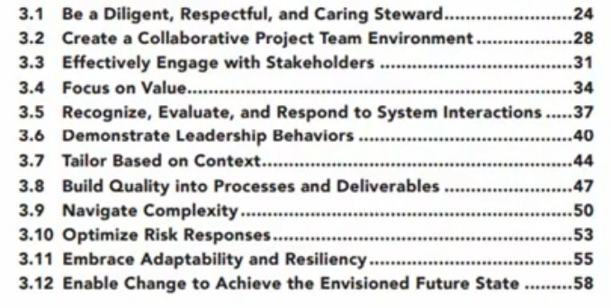

# Rules of Conduct

## Intro

These are meant to help you and not become a burden and any rules can be removed or added based on popular beliefs.&#x20;

## Values&#x20;

The number one things is to value each other and our efforts. We are all here for the hopes to gain more out of this experience than we originally came with and have a deliverable project based on our [scope ](scope-statement.md)statement. This means that to value teaching others and working together to make something and not just your own project that you can do anytime and change anything. In a group environment it is not just our own thoguhts but also of others we must care about.

## Participation Expectations&#x20;

The expaction is you write at least one line of code. This will be enough to put you as part of the authors list. However, you only get in life what you put the effort to. The more you contrubute and try the more it will push everyone else and increase the quality of our application in the end. This is mostly a self paced project with a slighlt timeframe to keep in mind.&#x20;

## How we communicate&#x20;

We will communicate via Discord or Github or Whatsapp.&#x20;

## How we'll manage meetings&#x20;

There is no expectations to have meetings but they are really important. The more meetings you have the better off the team will be in the future. However, really good communications and high expectations can reduce the need for more meetings. The meetings come more to play when multiple people's work needs to be put together or reviewed.&#x20;

## How we will solve problems&#x20;

This project is being set up with everyone's name in mind. Ths means you can almost do anything in the project as long as everyone is aware of it and understands. As long as things are decently documented and communication is top notch no issues should arise.&#x20;
